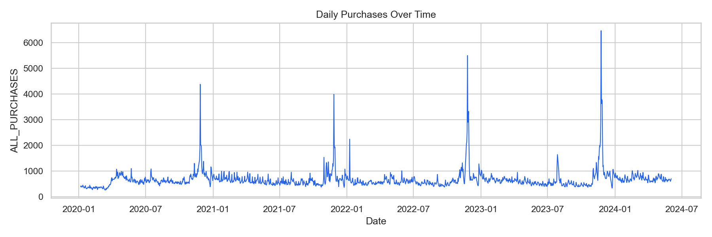
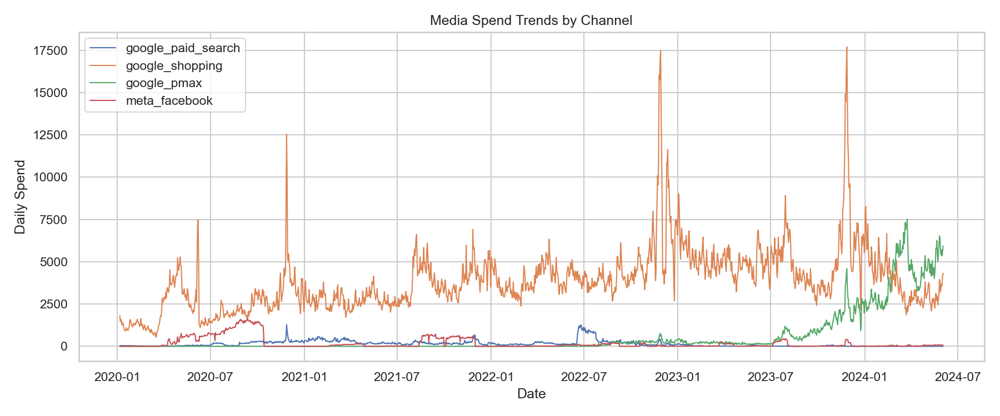
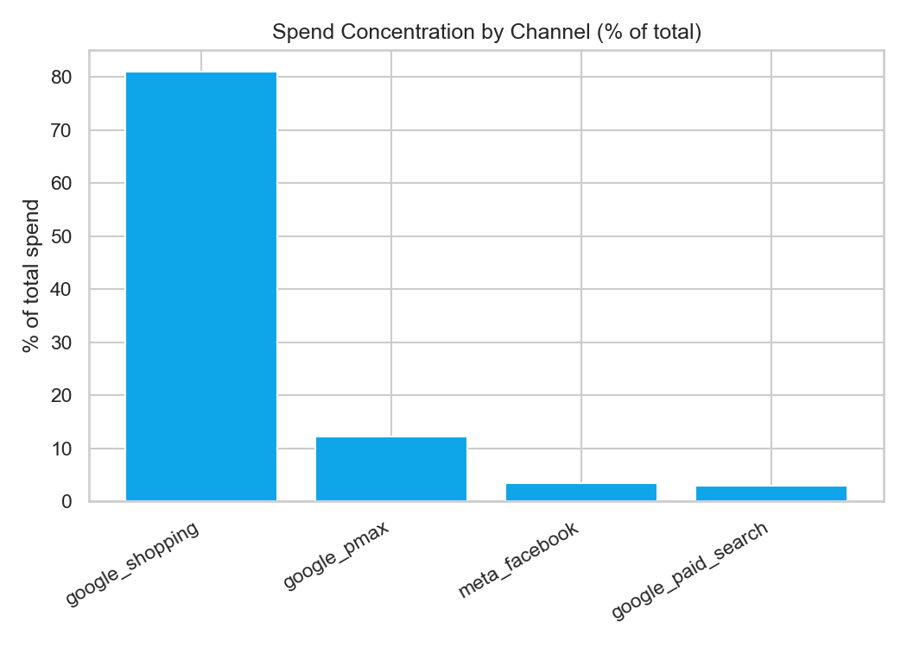
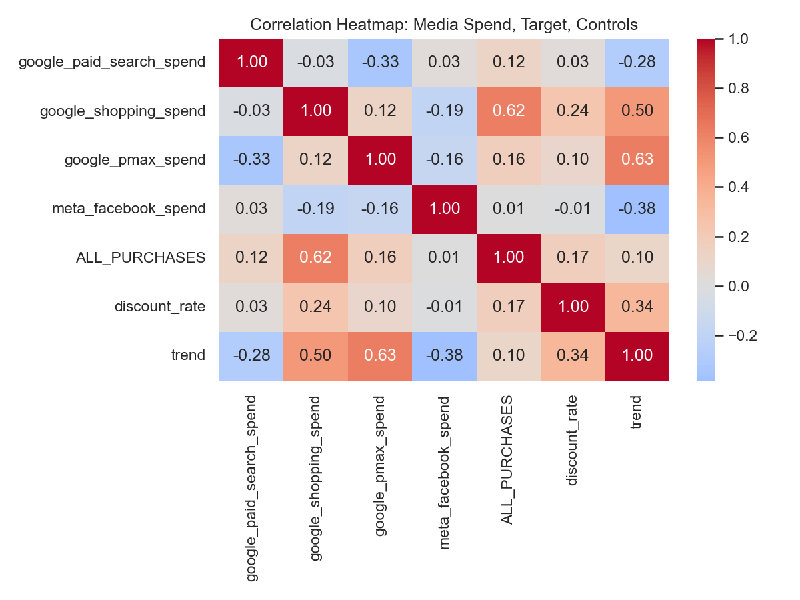
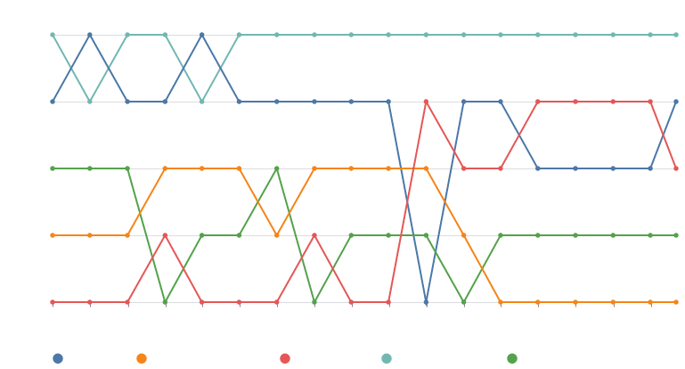
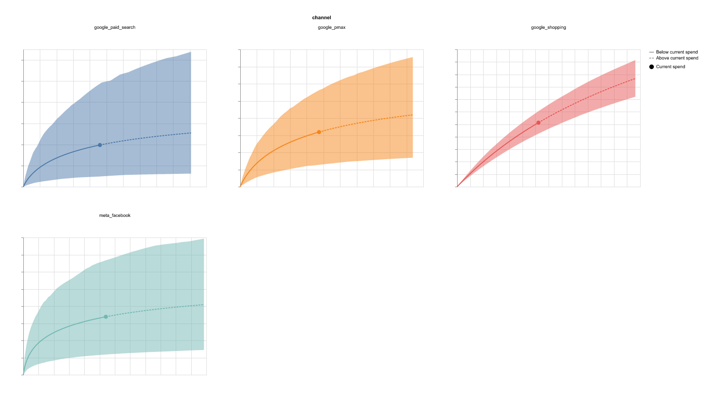
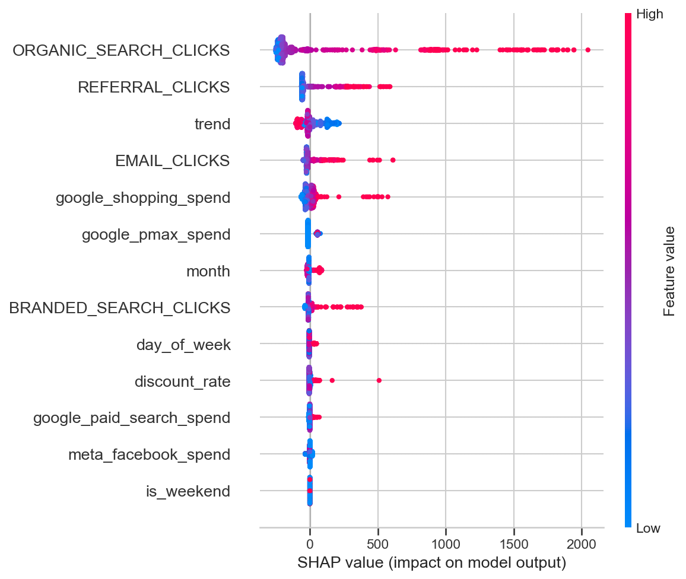
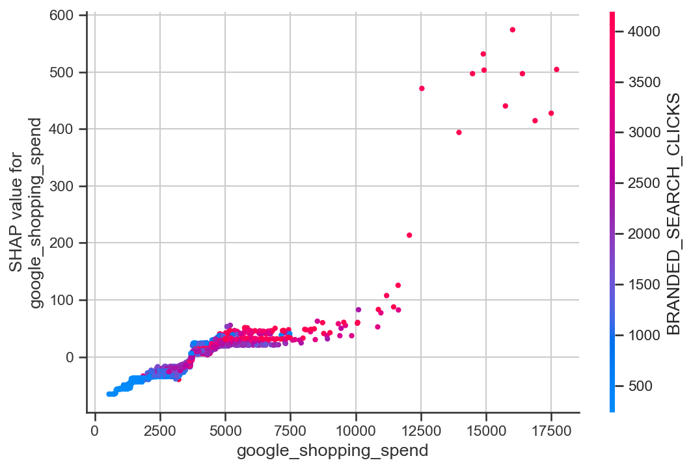
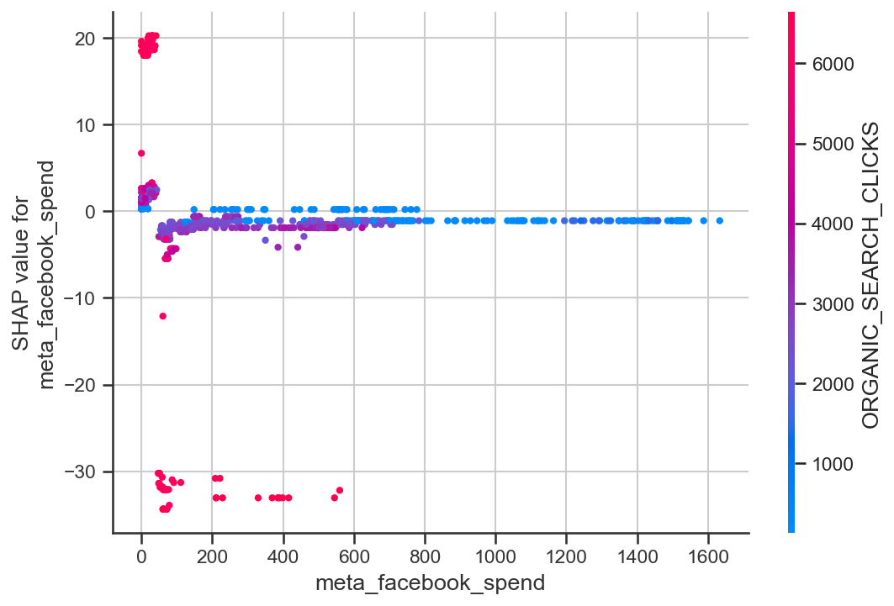
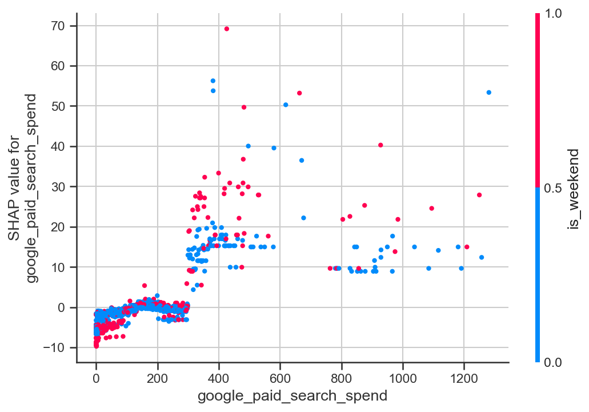

# Marketing Analytics: Meridian MMM — Channel ROI, SHAP Explainability & Budget Scenario Planning

A Bayesian marketing mix model (Google Meridian) quantifying channel-level ROI and marginal ROI across four advertising channels, cross-validated with SHAP explainability on a Gradient Boosting surrogate, and stress-tested with budget-reallocation scenario planning.

<!-- Optional badges — uncomment / edit once the repo is live


-->

## Overview

This project builds a marketing mix model (MMM) for a single organization to answer three questions: **which channels are actually driving purchases, which are saturated, and how should the budget be reallocated to generate more purchases without spending more?**

The analysis combines:
- **Google Meridian** — a Bayesian MMM with geometric adstock and Hill saturation, to estimate channel-level ROI and marginal ROI (mROI)
- **SHAP explainability** — a Gradient Boosting surrogate model to validate and interpret feature-level drivers of purchases
- **Scenario planning** — simulated budget reallocations compared against the historical baseline

## Key Findings

- The model covers **1,610 daily records** (Jan 2020 – Jun 2024) across four channels: **Google Paid Search, Google Shopping, Google PMax,** and **Meta Facebook**.
- **Google Shopping** dominates spend (81.1% of budget) and shows the strongest correlation with purchases (0.62).
- **Marginal ROI (mROI) is lower than average ROI for every channel** — expected as channels approach saturation. Google Paid Search, PMax, and Meta Facebook show signs of saturation; Google Shopping still has room to grow.
- Reallocating budget by mROI could increase purchases by **~12,600 (≈2.1%)** without increasing total spend.
- **Google PMax** has grown in importance since regular spending began in mid-2023; **Meta Facebook's** contribution has declined as its budget shrank after 2021.

## Table of Contents

- [Dataset](#dataset)
- [Methodology](#methodology)
- [Results](#results)
  - [Channel Contributions](#31-channel-contributions)
  - [ROI and mROI](#32-roi-and-mroi)
  - [SHAP Explainability](#33-shap-explainability)
- [Scenario Planning](#scenario-planning)
- [Business Recommendations](#business-recommendations)
- [Limitations](#limitations)
- [Tech Stack](#tech-stack)
- [Project Structure](#project-structure)

## Dataset

- **Scope:** one organization, national ("All Territories") level — selected for having the longest, most complete history and a consistent Google/Meta channel mix (out of 93 organizations/territories available).
- **Period:** 1,610 daily observations, 6 Jan 2020 – 2 Jun 2024.
- **Target:** `ALL_PURCHASES` (daily count).
- **Channels:** Google Paid Search, Google Shopping, Google PMax, Meta Facebook.
- **Controls:** organic/branded/referral/email traffic, discount rate, trend, day-of-week, `is_weekend`. `DIRECT_CLICKS` was excluded (zero variance for this organization).
- **Outliers:** 28 days flagged via |z| > 3, retained as genuine demand spikes rather than removed as errors.

<p align="center"></p>

*Fig. 1 — Daily purchases, Jan 2020–Jun 2024. Recurring November spikes, growing year over year, dominate the series (Black Friday / holiday promotions).*

<p align="center"></p>

*Fig. 2 — Daily spend by channel. Google Shopping is consistently dominant; Meta Facebook spend is concentrated in 2020 and largely absent after 2021; Google PMax only ramps up from mid-2023 onward.*

<p align="center"></p>

*Fig. 3 — Spend concentration: Google Shopping 81.1%, Google PMax 12.3%, Meta Facebook 3.5%, Google Paid Search 3.0%.*

## Methodology

**Model:** Google Meridian's Bayesian MMM, framed as a single-geo ("national") model. Geometric adstock and Hill saturation transformations are applied per channel to capture carryover and diminishing returns, with parameters inferred jointly via MCMC. A weakly-informative `LogNormal(0.2, 0.9)` prior is placed on channel-level ROI, shared across channels.

| Parameter | Value |
|---|---|
| Model type | National (single-geo), non-revenue KPI |
| Knots | 24 |
| Adstock | Geometric decay |
| Saturation | Hill |
| ROI prior | LogNormal(mean=0.2, sd=0.9), shared across channels |

<p align="center"></p>

*Fig. 4 — Correlation matrix of spend, target, and controls. Google Shopping spend correlates most strongly with purchases (0.62). Google PMax spend correlates strongly with the underlying trend (0.63), making it harder for the model to separate channel impact from organic business growth — a key source of uncertainty in PMax's estimates.*

## Results

### 3.1 Channel Contributions

<p align="center"></p>

*Fig. 5 — Channel contribution bump chart: relative contribution rank (1 = highest) across the 24 model knots, spanning the full period.*

Contribution is not evenly distributed or constant over time. Google Shopping (turquoise) remains one of the strongest, most stable contributors throughout. Other channels show more movement — one channel dips and recovers, another grows in importance later in the period, and another gradually declines — reflecting differences in spend timing, campaign activity, and channel saturation rather than a fixed hierarchy.

### 3.2 ROI and mROI

| Channel | ROI (mean) | mROI (mean) | Status |
|---|---|---|---|
| Google Shopping | 0.082 | 0.061 | Near-optimal |
| Google Paid Search | 0.086 | 0.033 | Over-invested (saturated) |
| Google PMax | 0.067 | 0.028 | Over-invested (saturated) |
| Meta Facebook | 0.063 | 0.017 | Over-invested (saturated) |

*ROI/mROI here measure purchases generated per unit of spend — not financial ROI.*

Marginal ROI is lower than average ROI for every channel, as expected under saturation. Google Shopping's mROI (0.061) is roughly **2×** Google Paid Search's and **3.6×** Meta Facebook's — making it the best channel for incremental budget. Google Paid Search's high average ROI should be read cautiously: its spend was concentrated in short bursts (late 2020, mid-2022), giving it a standard deviation (0.065) nearly as large as its mean.

<p align="center"></p>

*Fig. 6 — Hill saturation response curves by channel. Solid line = observed spend range; dashed = estimated impact beyond current spend; dot = current spend level; shaded area = uncertainty.*

Google Shopping's curve is still rising steadily with no clear flattening — room for more investment. Google Paid Search, PMax, and Meta Facebook all flatten past their current spend levels, confirming diminishing returns. Paid Search and Meta Facebook also carry the widest confidence intervals.

### 3.3 SHAP Explainability

A Gradient Boosting model (300 estimators, max depth 2, learning rate 0.03) was trained on the same features as the Meridian model to predict `ALL_PURCHASES` (80/20 time split), then explained with SHAP to cross-check which variables drive predictions.

<p align="center"></p>

*Fig. 7 — SHAP summary plot, features ranked by mean |SHAP value|.*

Organic search and referral clicks outrank every paid channel — expected, since these unpaid signals are closely tied to underlying demand that Meridian is specifically designed to disentangle from paid effects, while this simpler surrogate cannot. Among paid channels, **Google Shopping has the strongest influence**, consistent with the Meridian results.

<p align="center">


</p>

*Fig. 8 (left) — SHAP dependence: Google Shopping spend shows a clear positive, accelerating relationship above ~€10,000/day. Fig. 9 (right) — Google PMax's SHAP impact jumps from negative to a small positive value once spending starts, then flattens — consistent with PMax being a newer channel the model hasn't fully characterized yet.*

<p align="center">


</p>

*Fig. 10 (left) — Google Paid Search shows a positive spend-impact relationship, with some high-spend days showing outsized effects (likely coinciding with organic demand spikes). Fig. 11 (right) — Meta Facebook's SHAP values sit close to zero with some negative impact at low spend, reinforcing that it's the least efficient channel and may be over-funded relative to its effectiveness.*

The surrogate model's holdout R² was **-4.4** on the final 20% of data — it does not generalize well to the later period and should not be used for forecasting. This does not affect the SHAP analysis, which explains the model's existing predictions rather than future ones.

## Scenario Planning

Three budget-reallocation scenarios were simulated against the historical baseline (~613,581 incremental purchases), using the same total budget:

| Scenario | Incremental Purchases | vs. Historical Baseline | ROI |
|---|---|---|---|
| Equal allocation (25/25/25/25) | 332,187 | −281,394 | 0.043 |
| **mROI-optimized** | **626,164** | **+12,583** | **0.082** |
| Saturation-aware (30% shift, low→high mROI) | 616,883 | +3,301 | 0.080 |

The mROI-optimized allocation performs best (+2.1% purchases, same budget). A simpler, lower-risk move — shifting 30% of Meta Facebook's (lowest-performing) budget into Google Shopping (highest-performing) — captures about a quarter of that gain with one easy adjustment. Splitting the budget equally performs far worse (−46% vs. baseline), confirming that the current Google Shopping-heavy strategy is directionally correct.

## Business Recommendations

- **Shift budget from Meta Facebook and Google PMax toward Google Shopping**, which shows materially stronger marginal returns and no sign of saturation yet.
- **Start with a cautious 30% shift** from the lowest-performing channel into Google Shopping — low risk, easily reversible, and worth an estimated +3,301 purchases.
- **Test before scaling Google Paid Search.** Its average ROI looks strong, but high variance (driven by concentrated spend bursts) makes the estimate less reliable — validate with a smaller test first.
- **Review Google PMax more frequently.** It currently reads as over-invested, but its contribution has been improving as the channel matures — avoid large cuts based on its current snapshot.
- **Meta Facebook is the clearer candidate for reduction** — its declining contribution reflects genuine weakening performance, not just a short data history, so cuts here carry less risk to overall performance.

## Limitations

**Data quality**
- Single organization, single market — findings may not generalize to other businesses or regions.
- 28 high-value outlier days were retained rather than removed; if any reflect data issues rather than real demand, results could be affected.
- Meta Facebook (mostly pre-2021) and Google PMax (from 2023) have shorter, less complete spend histories, making their ROI/mROI estimates less reliable.

**Causal assumptions**
- This is an observational MMM, not a controlled experiment — competitor actions, market shifts, and platform changes aren't captured.
- Google PMax spend rose alongside overall business growth, making it hard to separate the channel's true incremental impact from organic growth trends.
- Adstock and saturation assumptions (effects build over time, then diminish) may not perfectly reflect real channel dynamics.

**Model uncertainty**
- Google Paid Search and Google PMax carry the highest uncertainty in their estimates. Google Shopping's results are the most stable, backed by the longest, most consistent spend history.

## Tech Stack

`Python` · `Google Meridian` (Bayesian MMM, MCMC) · `scikit-learn` (Gradient Boosting) · `SHAP` · `pandas` / `numpy` · `matplotlib` / `seaborn`

## Project structure

```text
project/
├── data/
│   ├── conjura_mmm_data.csv
│   ├── conjura_mmm_data_dictionary.xlsx
│   └── mmm_modeling_dataset.csv      <- produced by preprocessing.py
├── notebooks/
│   └── mmm_homework.ipynb
├── src/
│   ├── config.py                     <- org/channel selection, paths
│   ├── preprocessing.py              <- Task 2
│   ├── eda.py                        <- Task 1
│   ├── modeling.py                   <- Task 3
│   ├── roi.py                        <- Task 4
│   ├── shap_analysis.py              <- Task 5
│   ├── scenarios.py                  <- Task 6
│   └── main.py                       <- runs everything in order
├── outputs/
│   ├── charts/
│   ├── tables/
│   └── reports/                      <- final PDF presentation here
└── requirements.txt
```

## Author

**Rahemeen Mukhtiar** — MS Data Science, Università degli Studi di Milano-Bicocca
